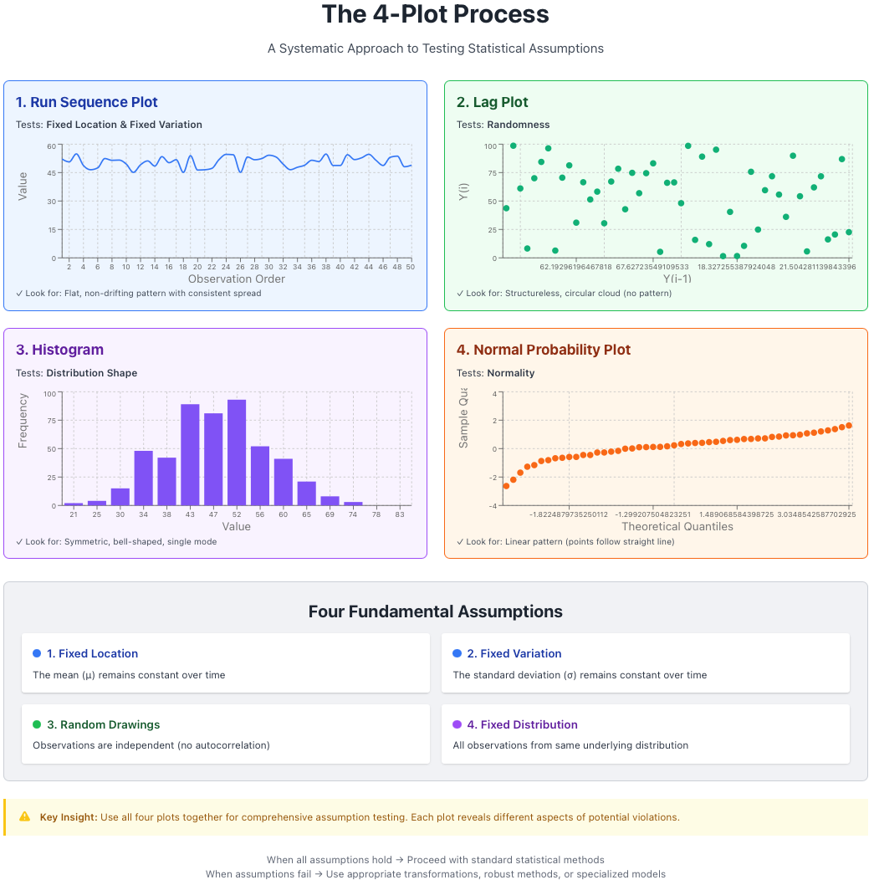
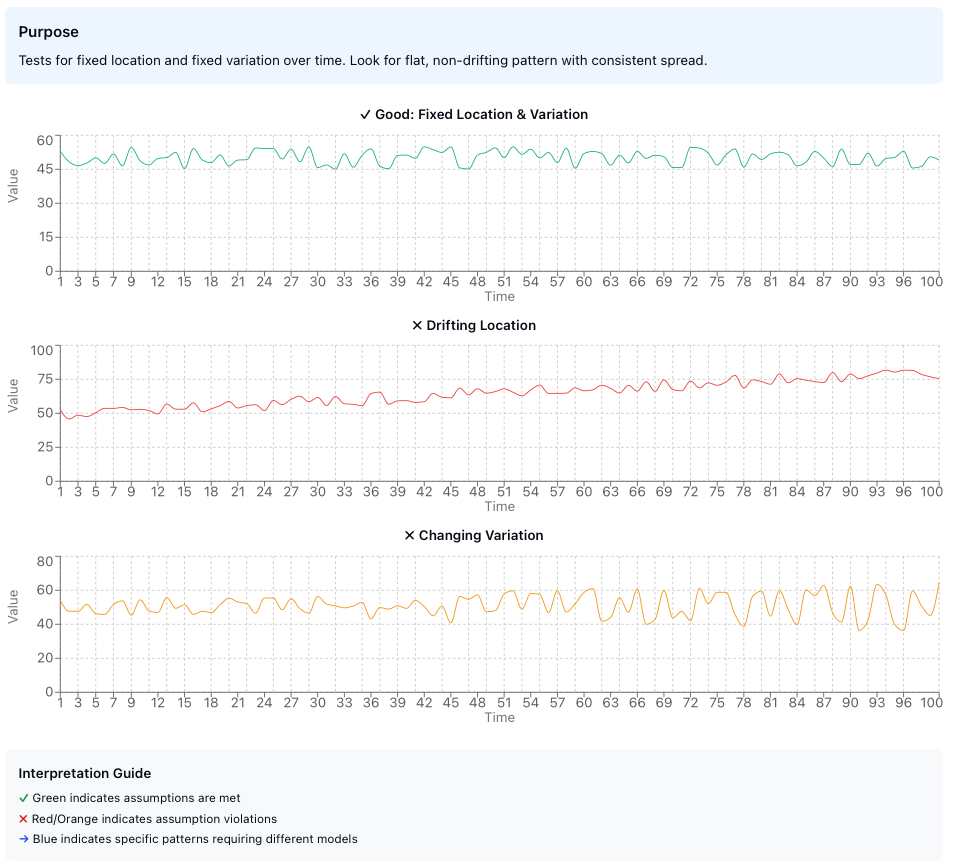
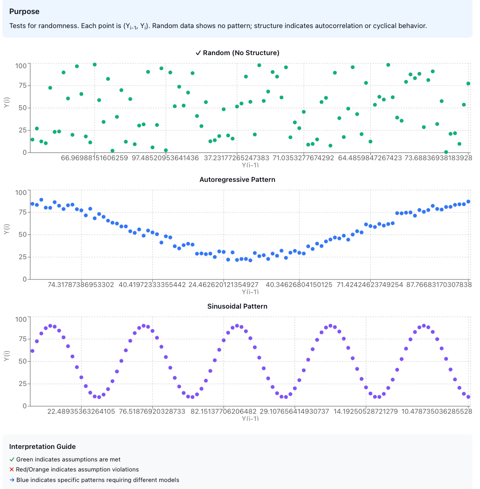
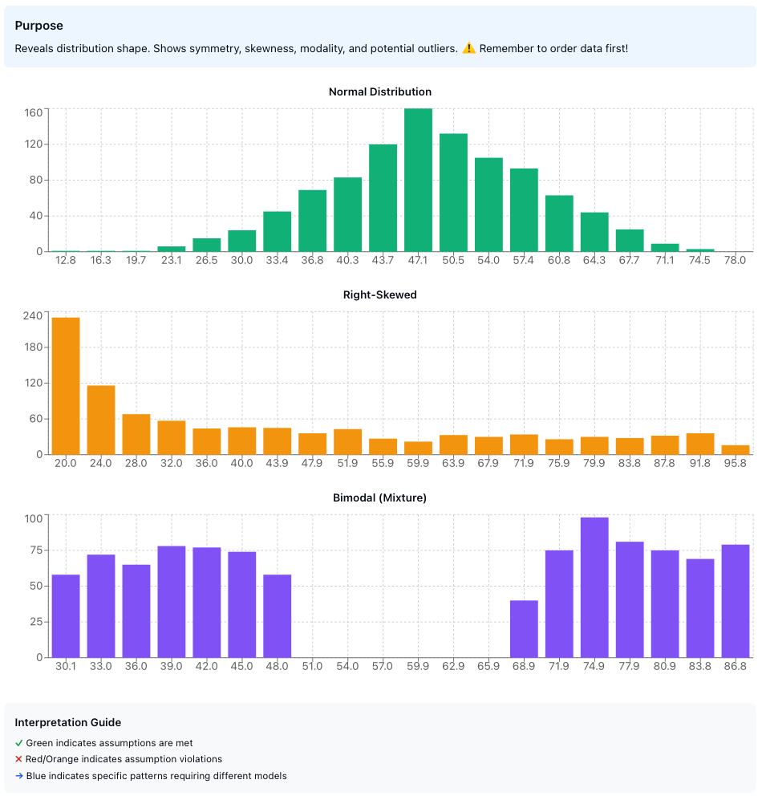
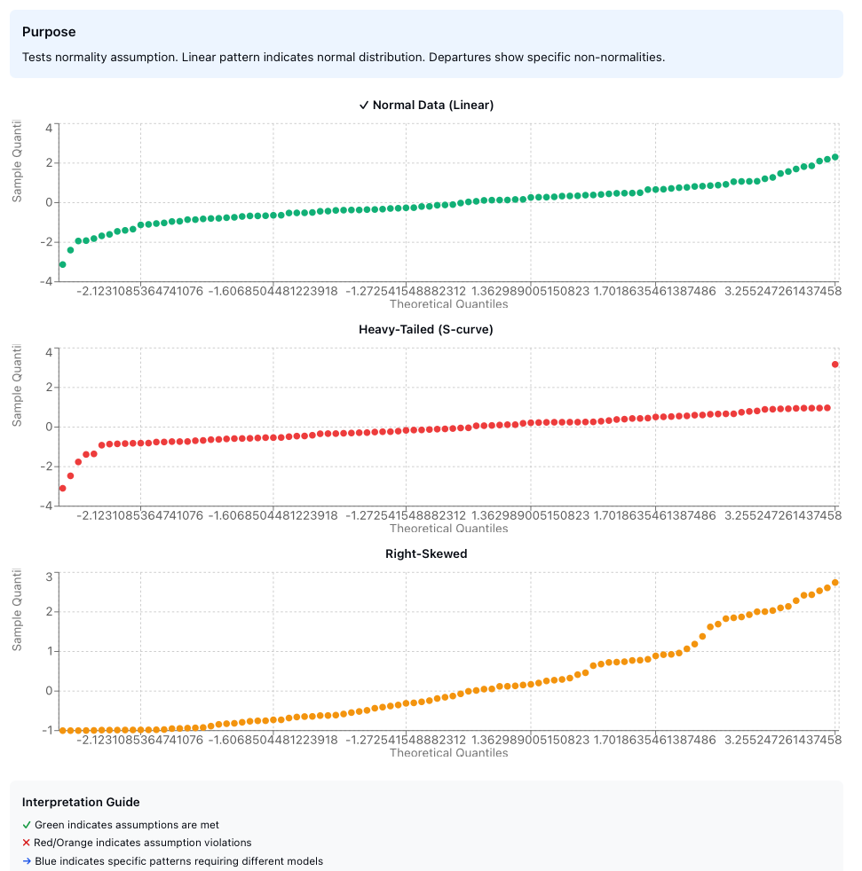

---

Statistical analysis rests on a foundation of critical assumptions. When these assumptions hold, our estimates are reliable, our tests are valid, and our conclusions are sound. When they fail, even the most sophisticated analysis crumbles into meaninglessness. This post explores the systematic techniques for testing the four fundamental assumptions underlying most statistical analyses: **random drawings**, **fixed distribution**, **fixed location**, and **fixed variation**.

## Why Test Assumptions?

Before diving into techniques, let's understand what's at stake when assumptions fail:

**When randomness fails:**
- The usual location estimate (mean) becomes suspect
- Standard statistical tests become invalid
- Adjacent values become related rather than independent
- We have fewer truly independent samples than we think

**When location drifts:**
- A single location estimate becomes meaningless
- Common uncertainty calculations lose validity
- Our choice of location estimator becomes sub-optimal

**When variation drifts:**
- The standard deviation no longer captures the true variability
- A single variation estimate becomes meaningless
- Location and variation estimates inherit noise and additional variability

**When distribution changes:**
- The assumed distribution no longer applies
- Simple parametric models become useless
- Distribution-specific error bounds become unknown
- Parameter estimates lack support

The good news? Assumption testing promotes insight into data that may never surface otherwise. Let's explore how.

## The 4-Plot Process

The cornerstone of assumption testing is the **4-plot process**, a systematic visual diagnostic that simultaneously checks all four fundamental assumptions. This quartet of plots provides a comprehensive view of your data's behavior:


*Figure 1: The 4-plot process for comprehensive assumption testing. Each plot tests specific assumptions simultaneously.*

### 1. Run Sequence Plot

**Purpose:** Tests for fixed location and fixed variation over time.

**Construction:** Plot your data values against their observation order (time sequence).

**What to look for:**

| Observation | Conclusion |
|-------------|------------|
| Flat, non-drifting pattern | Location parameter (μ) is stable over time |
| Consistent vertical spread | Variation parameter (σ) is stable over time |

A good run sequence plot should appear structureless—no trends, no patterns, no systematic changes. Think of it as the control chart of assumption testing.


*Figure 2: Run sequence plots showing (top) ideal behavior with fixed location and variation, (center) drifting location, and (bottom) changing variation.*

**Key statistics to extract:**
1. **Mean, maximum, and minimum** - Basic location measures
2. **Range and standard deviation** - Variation measures  
3. **Outliers** - Extreme values that may need investigation
4. **Randomness** - Visual assessment of structure
5. **Autocorrelation** - Are consecutive values related?
6. **Seasonality** - Periodic patterns in the data

The run sequence plot serves as your first line of defense against hidden temporal patterns. If you observe a trend, drift, or systematic pattern, your data violates the fixed location or fixed variation assumption, and subsequent analyses must account for this structure.

### 2. Lag Plot

**Purpose:** Tests for randomness in the data sequence.

**Construction:** Plot each observation $y_i$ against its predecessor $y_{i-1}$. This creates a scatter plot where each point represents $(y_{i-1}, y_i)$.

**What to look for:**

A structureless cloud indicates that the randomness assumption holds. The data points should show no discernible pattern.

**Pattern recognition for model suitability:**


| Lag Plot Pattern | Interpretation |
|------------------|----------------|
| Elliptical shape | Autoregressive model appropriate |
| Sinusoidal pattern | Cyclical/seasonal model needed |
| Linear relationship | Strong autocorrelation present |


*Figure 3: Lag plot patterns. (top) Random data shows no structure, (center) Autoregressive data shows elliptical pattern indicating correlation between consecutive observations, (bottom) Periodic data shows sinusoidal structure requiring seasonal modeling.*

**The autocorrelation problem:** When randomness fails due to autocorrelation, adjacent values become related. This means:
- Your $N$ samples are not truly independent
- The effective sample size is smaller than $N$
- Uncertainty estimates need correction: $\sigma_{\text{eff}} = \sigma \sqrt{1 + 2\sum_{k=1}^{m} \rho_k}$ where $\rho_k$ is the autocorrelation at lag $k$

The lag plot is particularly powerful because it transforms a temporal relationship into a spatial one, making patterns immediately visible that might be subtle in a time series plot.

### 3. Histogram

**Purpose:** Tests for fixed variation, fixed location, and reveals the underlying distribution shape.

**Construction:** A **critical step** is to order your dataset before creating the histogram. The histogram bins your data and displays frequency counts.

**What it tells us:**

1. **Symmetry:** Is the distribution symmetric or skewed?
2. **Sample size adequacy:** Do we have enough data to characterize the distribution?
3. **Location stability:** Is there a single, well-defined center?
4. **Distribution type:** Can we identify the family of distributions?

**Distribution diagnostics:**

The histogram can reveal various departures from the assumed distribution:

- **Right skew:** Long tail extending to the right
- **Left skew:** Long tail extending to the left  
- **Heavy-tailedness:** More extreme values than expected
- **Light-tailedness:** Fewer extreme values than expected
- **U-shaped:** Bimodal with values concentrated at extremes
- **J-shaped:** Monotonic increase or decrease
- **Mixture:** Multiple overlapping distributions
- **Truncated:** Cut-off at minimum or maximum values


*Figure 4: Common histogram patterns indicating different distribution characteristics. Normal, right-skewed, and bimodal distributions shown with their characteristic shapes.*

The histogram provides the first glimpse into your data's distributional properties. While not as precise as formal goodness-of-fit tests, it offers immediate visual feedback about whether normality or other distributional assumptions are reasonable.

### 4. Normal Probability Plot

**Purpose:** Specifically tests whether the distribution is normal (Gaussian).

**What it is:** A quantile-quantile (Q-Q) plot comparing your data's quantiles against theoretical normal distribution quantiles.

**Construction procedure:**

1. **Order the data:** Sort observations from smallest to largest: $y_{(1)} \leq y_{(2)} \leq \cdots \leq y_{(n)}$

2. **Calculate cumulative probability:** For the $i$-th ordered observation:
   $$p_i = \frac{i - 0.5}{n}$$

3. **Find the corresponding z-value:** Compute the inverse standard normal:
   $$z_i = \Phi^{-1}(p_i)$$

4. **Create scatter plot:** Plot $(z_i, y_{(i)})$ for all observations

**Interpretation:**

| Q-Q Plot Pattern | Distribution Characteristic |
|------------------|----------------------------|
| Linear (straight line) | Normal distribution - assumption holds ✓ |
| S-shaped curve | Heavy-tailed distribution |
| Inverted S-curve | Light-tailed distribution |
| Steeper right side | Right skewed |
| Steeper left side | Left skewed |
| Multiple segments | Mixture distribution |
| Jump or gap | Suspected outliers |


*Figure 5: Normal probability plots showing (top) normally distributed data with linear pattern, (center) heavy-tailed distribution with S-shaped curve, (bottom) right-skewed distribution with steeper right side.*

The normal probability plot is less steep than skewness alone would suggest for both left and right truncation patterns—an important diagnostic detail often overlooked. This plot is more sensitive to departures from normality than the histogram, particularly in the tails of the distribution.

## The Assumption Framework

Let's formalize the four fundamental assumptions:

### Assumption 1: Random Drawings

**Statement:** Observations are independent and randomly sampled from the population.

**Mathematical formulation:** For observations $y_1, y_2, \ldots, y_n$:
$$
\text{Cov}(y_i, y_j) = 0 \quad \forall i \neq j
$$

**Testing:** Primarily through lag plots and run sequence plots.

**Failure consequences:**
- Standard errors are underestimated
- Confidence intervals are too narrow
- Hypothesis tests have inflated Type I error rates
- Undetected information structure in the data
- Undetected "junk" outliers mask true relationships

### Assumption 2: Fixed Distribution

**Statement:** All observations come from a single, unchanging underlying distribution.

**Mathematical formulation:** 
$$
y_i \sim F(\theta) \quad \forall i, \text{ where } \theta \text{ is constant}
$$

This is the "identically distributed" part of i.i.d. (independent and identically distributed).

**Testing:** Run sequence plot for stability over time, histogram for shape consistency.

**Failure consequences:**
- Single distribution assumption becomes meaningless
- Distribution type becomes unknown
- Distribution-specific error bounds are invalid
- Simple parametric models are not useful
- Minimum sample sizes for tolerance intervals lose meaning

### Assumption 3: Fixed Location

**Statement:** The central tendency (location parameter) remains constant across observations.

**Mathematical formulation:**
$$
E[y_i] = \mu \quad \forall i
$$

**Testing:** Run sequence plot should show no trend or drift.

**Failure consequences:**
- The mean as a single location estimate becomes meaningless
- Location/variation estimates inherit additional noise
- Choice of location estimator becomes sub-optimal
- Uncertainty estimates lose validity

### Assumption 4: Fixed Variation

**Statement:** The dispersion (scale parameter) remains constant across observations.

**Mathematical formulation:**
$$
\text{Var}(y_i) = \sigma^2 \quad \forall i
$$

**Testing:** Run sequence plot should show consistent vertical spread.

**Failure consequences:**
- Standard deviation as a single variation estimate becomes meaningless
- Variation estimates become poor and biased
- Outlier detection becomes unreliable
- Prediction intervals become invalid

## Practical Workflow

Here's a systematic approach to assumption testing:
```
1. Collect Data
   ↓
2. Run 4-Plot Process
   ├─ Run Sequence Plot → Check location & variation stability
   ├─ Lag Plot → Check randomness
   ├─ Histogram → Assess distribution shape
   └─ Normal Probability Plot → Test normality
   ↓
3. Identify Violations
   ↓
4. Take Corrective Action
   ├─ Transform data (log, square root, etc.)
   ├─ Use robust methods
   ├─ Model the structure (e.g., time series)
   ├─ Remove/investigate outliers
   └─ Use distribution-free methods
   ↓
5. Re-test Assumptions
   ↓
6. Proceed with Analysis
```

This workflow emphasizes that assumption testing is not a one-time check but an iterative process. When violations are detected, corrective actions must be followed by re-testing to ensure the remediation was successful.

## Connection with Statistical Modeling

The assumption testing framework connects directly to the choice of statistical model:

**Linear regression assumes:**
- Random, independent errors
- Fixed distribution of errors  
- Fixed location (zero mean errors)
- Fixed variation (homoscedasticity)

The 4-plot process on residuals validates these assumptions simultaneously.

**Time series analysis emerges when:**
- Lag plot shows structure → Use ARMA/ARIMA models
- Run sequence shows trend → Use trend models or differencing
- Run sequence shows seasonality → Use seasonal models

**Robust methods needed when:**
- Heavy-tailed distributions detected → Use M-estimators, trimmed means
- Outliers present → Use robust scale estimators (MAD, IQR)
- Skewed distributions → Use median instead of mean

This connection illustrates that assumption testing is not merely a prerequisite for analysis—it actively guides model selection and methodological choices.

## Advanced Considerations

### Autocorrelation Correction

When randomness fails due to autocorrelation with correlation coefficient $\rho$, the effective standard error requires correction:

$$
SE_{eff} = SE_{naive} \times \sqrt{\frac{1 + \rho}{1 - \rho}}
$$

For high correlation ($\rho \to 1$), this correction factor becomes substantial:
- At $\rho = 0.5$: $SE_{eff} \approx 1.73 \times SE_{naive}$ (73% inflation)
- At $\rho = 0.8$: $SE_{eff} \approx 3.00 \times SE_{naive}$ (200% inflation)

### Sample Size Requirements

Each assumption test has different sample size requirements:

- **Run sequence plot:** Minimum $n \approx 20$ for pattern detection
- **Lag plot:** Minimum $n \approx 50$ for reliable structure assessment  
- **Histogram:** Minimum $n \approx 30$; prefer $n > 100$ for shape determination
- **Normal probability plot:** Minimum $n \approx 20$; works well for $n > 50$

These are guidelines, not absolute rules. With smaller samples, visual diagnostics become less reliable, and formal tests may be necessary to supplement visual inspection.

### Multiple Testing Consideration

When conducting multiple assumption tests, remember that we're not performing formal hypothesis tests but rather visual diagnostics. The 4-plot process is designed for comprehensive screening, not for controlling Type I error rates across multiple comparisons.

The strength of the 4-plot approach lies in its complementarity: each plot reveals different aspects of potential assumption violations, and together they provide a robust diagnostic framework that is greater than the sum of its parts.

## Implementation Example

Consider a quality control scenario where you're monitoring a manufacturing process. You collect 100 consecutive measurements:

1. **Run Sequence Plot** reveals a gradual upward trend → Location is not fixed
2. **Lag Plot** shows a linear pattern → Strong autocorrelation present
3. **Histogram** appears roughly normal → Distribution shape is acceptable
4. **Normal Probability Plot** shows slight heavy tails → Minor departure from normality

**Interpretation:** The process is drifting over time with autocorrelated measurements. Standard statistical process control charts will be invalid. 

**Recommended action:** 
- Investigate the root cause of the trend (tool wear, temperature drift, etc.)
- Apply time series methods (ARIMA) instead of assuming i.i.d. data
- Use robust methods to handle heavy tails
- Consider first-differencing to remove the trend before further analysis

## Summary

### Key Takeaways

The systematic testing of statistical assumptions through the 4-plot process provides:

1. **Comprehensive diagnostics** - All four fundamental assumptions tested simultaneously
2. **Visual insight** - Patterns and violations immediately apparent
3. **Model guidance** - Suggests appropriate modeling approaches when assumptions fail
4. **Quality assurance** - Validates that subsequent analyses rest on solid foundations

### When Assumptions Hold

- Mean provides valid location estimate
- Standard deviation captures true variability
- Statistical tests maintain nominal error rates
- Confidence intervals have correct coverage
- Predictions have stated accuracy

### When Assumptions Fail

The consequences are not merely theoretical—they fundamentally undermine the validity of statistical inference. However, assumption testing transforms potential disaster into opportunity: by revealing the true structure of your data, you can choose more appropriate methods or transform your data to meet the required conditions.

**Critical insight:** Assumption failures are not obstacles to overcome but information to exploit. A lag plot showing autoregressive structure tells you to use time series methods. A histogram showing skewness suggests robust estimators or transformations. The 4-plot process doesn't just validate your analysis—it guides you toward better analysis.


## References

[1] NIST/SEMATECH e-Handbook of Statistical Methods. ["Techniques for Testing Assumptions."](https://www.itl.nist.gov/div898/handbook/eda/section3/eda33.htm) National Institute of Standards and Technology.

[2] Box, G.E.P. and Jenkins, G.M. "Time Series Analysis: Forecasting and Control." Holden-Day, 1970.

[3] Anscombe, F.J. "Graphs in Statistical Analysis." *American Statistician*, 27(1):17-21, 1973.

[4] Cleveland, W.S. "Visualizing Data." Hobart Press, 1993.

[5] Tukey, J.W. "Exploratory Data Analysis." Addison-Wesley, 1977.

[6] Chambers, J.M., Cleveland, W.S., Kleiner, B., and Tukey, P.A. "Graphical Methods for Data Analysis." Wadsworth, 1983.

[7] Cook, R.D. and Weisberg, S. "Diagnostics for Heteroscedasticity in Regression." *Biometrika*, 70(1):1-10, 1983.

[8] Durbin, J. and Watson, G.S. "Testing for Serial Correlation in Least Squares Regression." *Biometrika*, 37(3-4):409-428, 1950.